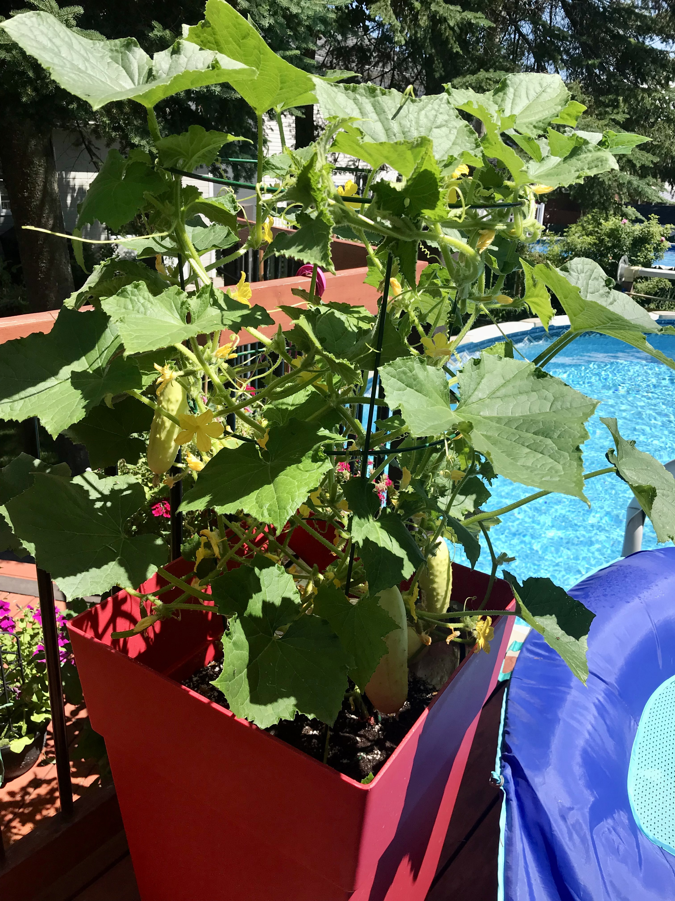
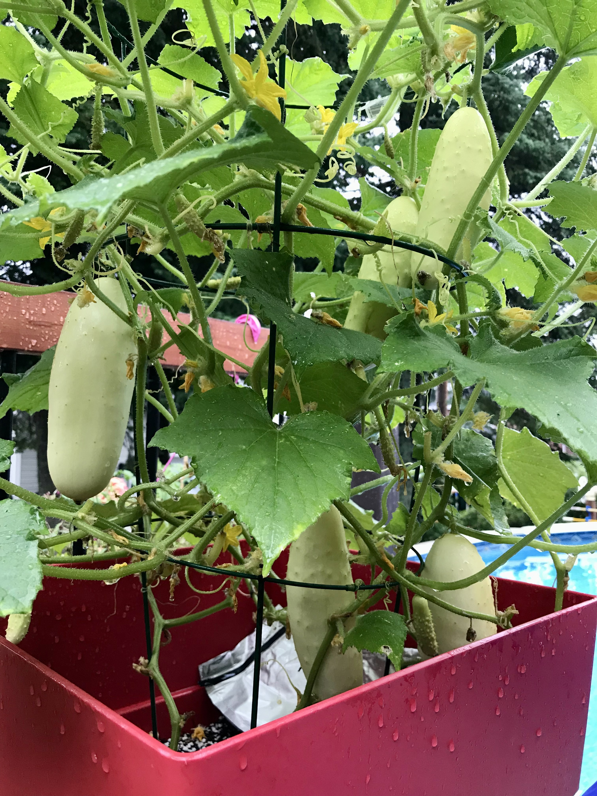
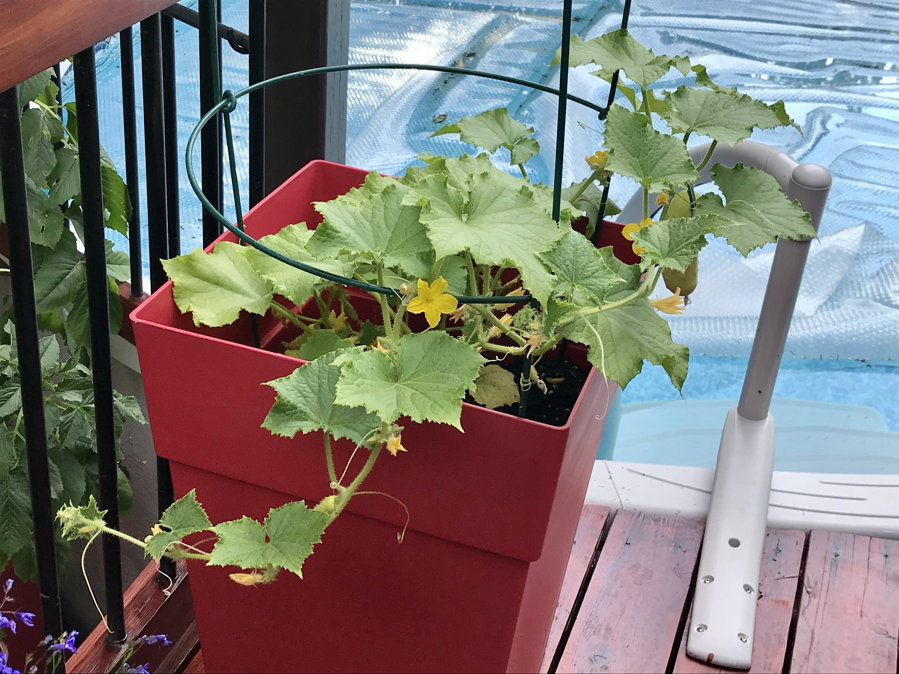
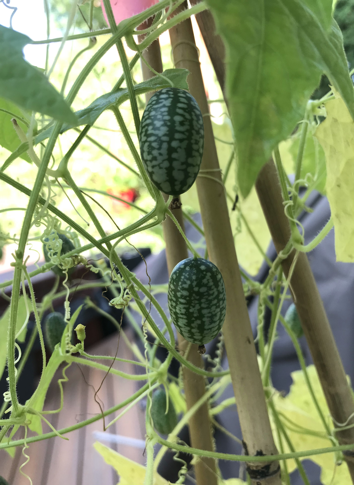
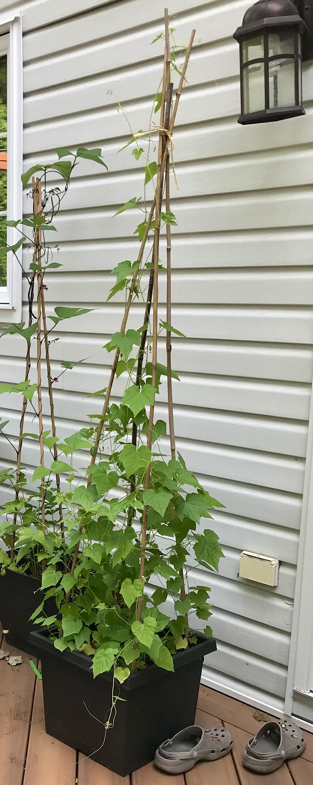

# Concombres
### Raider
Concombre de 5-7 po de long avec assez bonne résistance aux maladies. Goût moyen.

* 2020 : 3 plants en pot avec tuteur à pivoine. > 10 concombres.
* 2021 : 2 plants en terre, TRÈS PEU performants. 
  + Production : 4 concombres

|  |  |
|:--:|:--:|
| 4 plants de Raider en pot (2020/07/14) | (2020/08/13) |

### Martini
Variété de concombres préférée. Fruit blanc de 4-5 po de long avec EXCELLENT goût. Plants très productifs.

* 2019 : En bac long peu profond, mais bonne production quand même (5-6 concombres).
* 2020 : 4 plants en pot sur deck de piscine. Vraiment performant, production précoce dès juin.
* 2021 : Semis fin avril en serre à humidité élevée (50-60 %). Croissance des semis plus lente qu'en 2020. Établissement lent à l'extérieur en juin. Moins performant qu'en 2020 et production plus tardive en juillet. 2 plants en terre et 2 plants en pot. Meilleure performance en pot.
  + Production : 14 concombres

|  |  |
|:--:|:--:|
| 3 plants de Martini en pot (2020/07/14) | (2020/07/26) |

|
|:--:|
| 3 plants de Martini en pot (2021/08/02) |

### Cucamelon
Micro concombres de 1 po long qui poussent sur plant grimpant très fragiles, mais productifs. Fonctionne bien avec tuteurs de bambou. Goût de concombre citronné. Super mignon.

* 2019 : 4 plants en pot, croissance sur tipi de bambou. Très bonne production ! 
* 2020 : 4 plants en pot.
* 2021 : 4 plants en pot, démarrage tardif après transplantation à la fin mai.
  + Production : 52 cucamelons
  
|  |  |
|:--:|:--:|
| 4 plants de cucamelon en pot (2020/06/10)) | (2019/08/13) |

| |
|:--:|
| 4 plants de cucamelon en pot (2021/08/02) |
  
