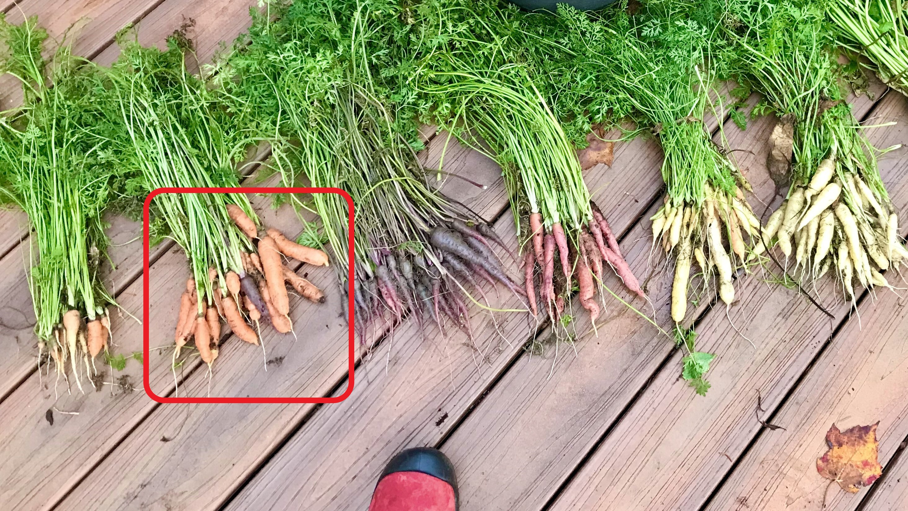
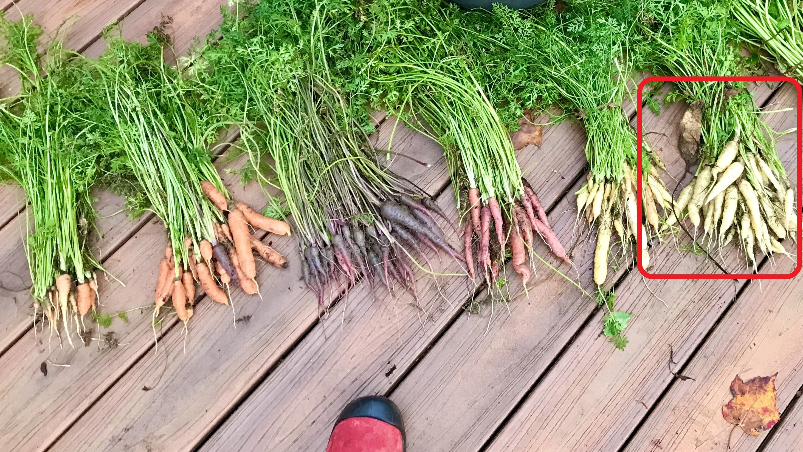
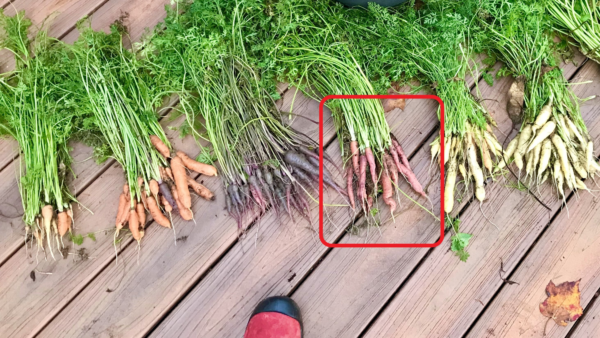
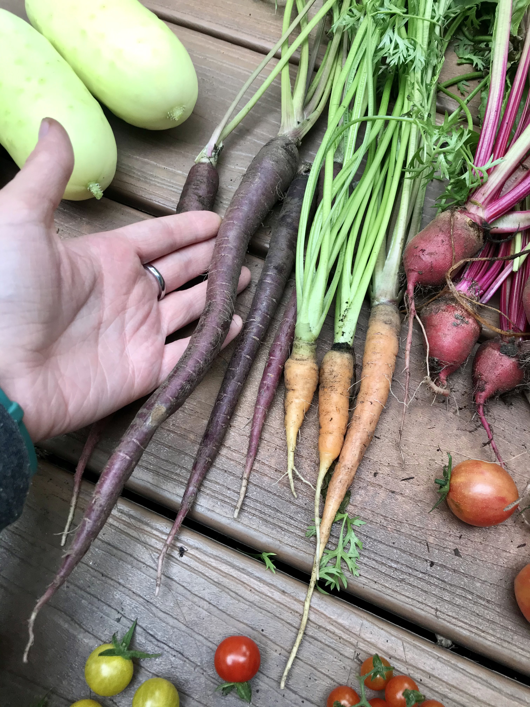
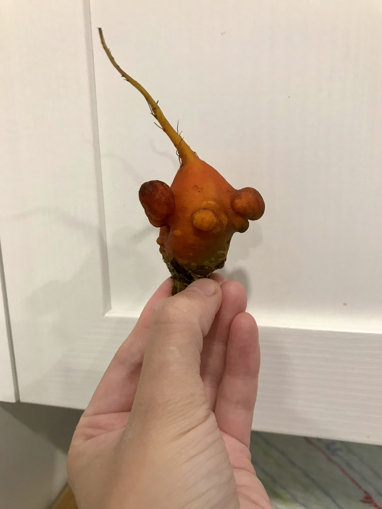
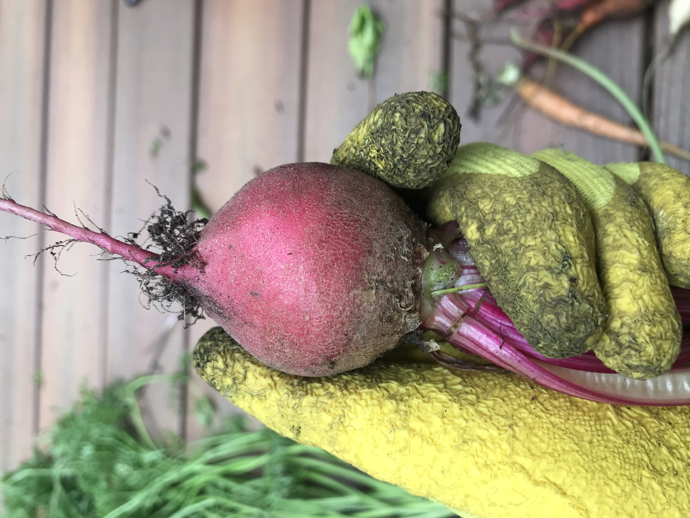

# Carottes

### Chantenay Red Cored
Carotte à gros diamètre. Jamais réussi à en avoir...

* 2020 : Aucune production en pot :(
* 2021 : En terre. Quelques carottes de < 1 po de long :( 

### Yaya
Carotte nantaise.

* 2020 : Rien
* 2021 : Une vingtaines de carottes de 2-3 po de long. En terre.

|
|:--:|
| Yaya (2e à partir de gauche) (2021/08/29) |

### White Satin
Carotte Imperator blanche

* 2020 : Rien
* 2021 : En terre. Variété la plus productive, quelques dizaine de carottes de 2-4 po de long. Bon goût.

|
|:--:|
| White satin (1ère à droite) (2021/08/29) |

### Rainbow 
Carotte Imperator jaune ou orange

* 2020 : Rien
* 2021 : Quelques carottes minuscules de couleur assez uniforme, peu de distinction entre les Rainbow jaunes et les Rainbow oranges. En terre. Faible production peu intéressante.

### Malbec
Carotte Imperator rouge

* 2020 : Rien
* 2021 : Quelques carotte de 2-3 po de long. En terre. Pas de goût particulier.

|
|:--:|
| Malbec (centre - droite) (2021/08/29) |

### Deep Purple
Carotte Imperator violette

* 2020 : Rien
* 2021 : En terre. Variété la plus productive (avec White Satin). 2-3 dizaines de carottes de 2-3 po de long. Une carotte très longue de > 6 po.

|
|:--:|
| Carotte Deep Purple, la plus longue de tout le jardin ! (2021/08/12) |

# Betteraves
### Avalanche
Betterave à chair **blanche**.

* 2020 : En pot. Peu de production, attaquée par mineuses 
* 2021 : Semis en mai en terre sableuse + compost. Faible production : quelques betteraves très petites : sol trop compact ? 

### Boldor
Betterave à chair **jaune** sucrée. Très belle.

* 2020 : En pot. Peu de production, attaquée par mineuses 
* 2021 : Semis en mai en terre sableuse + compost. Meilleure production qu'Avalanche et Chioggia, mais très petites.

|  |  |
|:--:|:--:|
| Betterave Boldor et son sosie (2021/08/29) | ... et son sosie (2021/08/29) |

### Chioggia
Betterave à chair rayée rouge et blanche.

* 2020 : En pot. Peu de production, attaquée par mineuses 
* 2021 : Semis en mai en terre sableuse + compost. Quelques betteraves très petites.

|
|:--:|
| Petite chioggia (2021/08/29) |

# Panais

### Harris Model
Panais bien blanc.

* 2020 : Semis en pots. Aucune production, peu de germinaison.
* 2021 : Semis en mai en terre sableuse + compost. Surprise : certaines graines semées en 2020 dans pots de tomates ont germé au printemps 2021. Faible production mais plus qu'en 2020, quelques panais de 2-3 po de long et très minces.

# Oignons

### Northstar
Oignon jaune ? Je sais pas ce qu'il goûte, c'est pas bon les oignons ! 

* 2021 : Semis à l'intérieur au mois de mars ou avril. Bonne germination, tige ont mauvaise odeur d'oignon. Transplantation à l'extérieur en mai, en terre. Quelques oignons cueillis en septembre, mais très petis, 1 po de diamètre max.. Sol trop compact ? 
