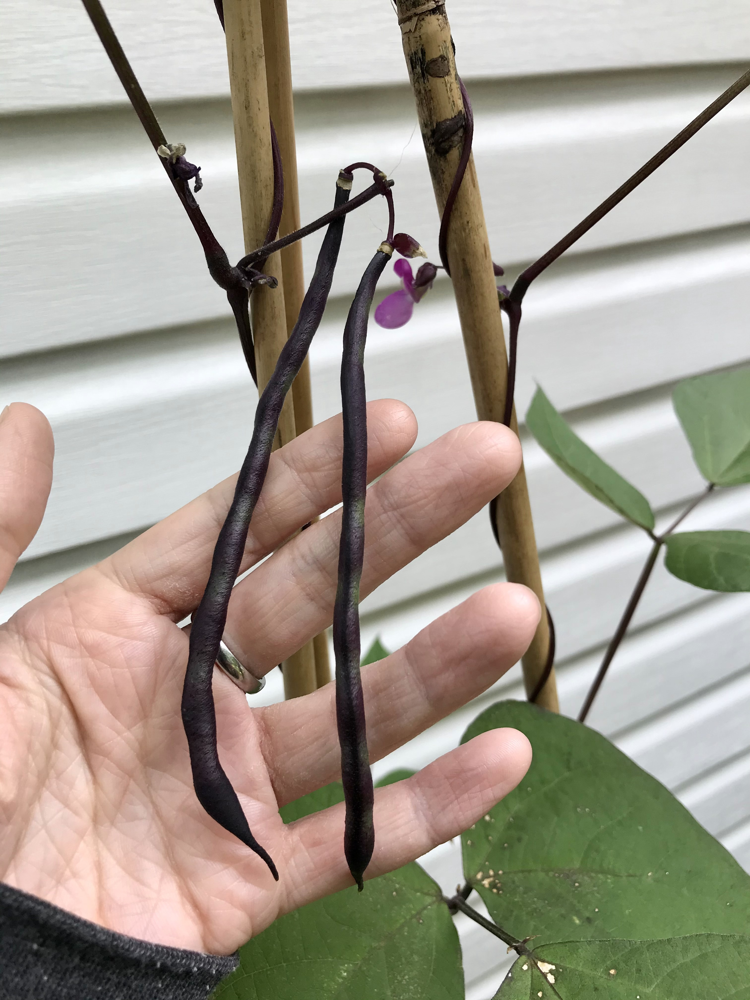
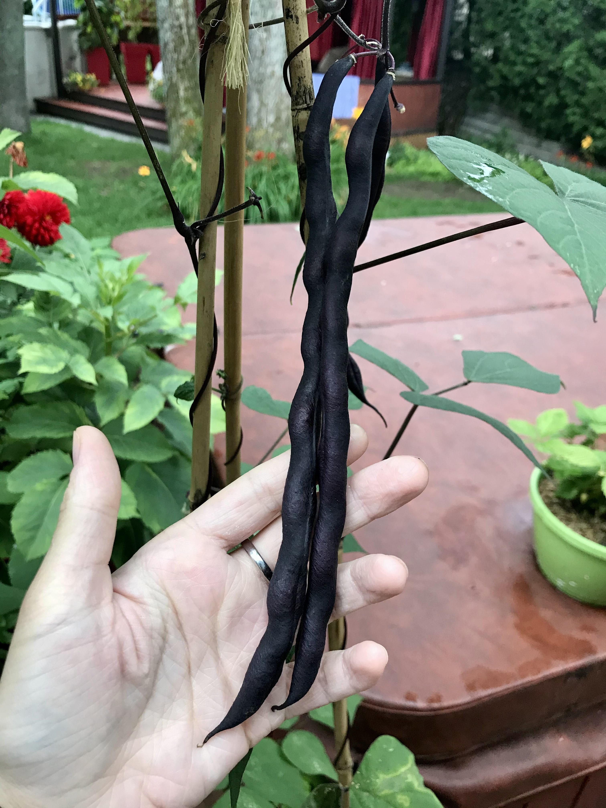
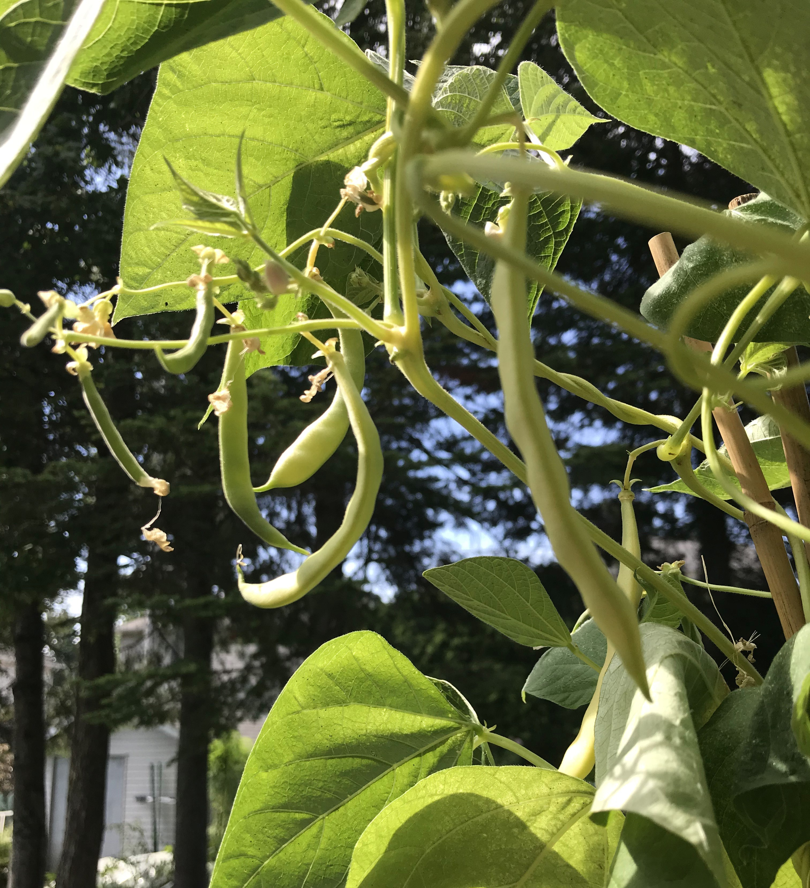
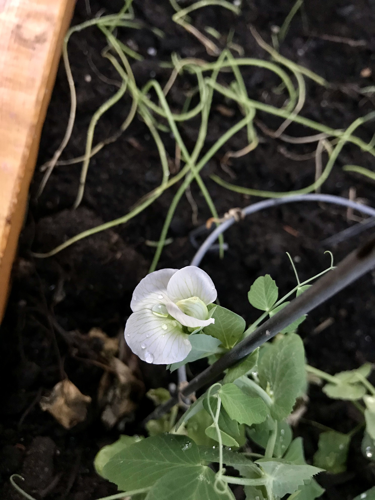

# Haricots

### Carminat
Haricot violet foncé qui devient vert à la cuisson vapeur. Les tiges du plant sont foncées et grimpantes. Fleurs violettes vraiment belles. 

* 2021 : 4 semis en pot directement à l'extérieur en mai. Croissance sur tipi de bambou. Production faible, 10-20 haricots seulement : besoin de mycorhize ? 

|  |  |
|:--:|:--:|
| Carminat avec fleur (2021/08/02) | Carminat (2021/08/11) |

### Grand-Maman Dinel
Variété québécoise. Haricot jaune à fleurs blanches

* 2021 : 4 semis en pot à l'extérieur en juin. Tipi de bambou. Faible production, semis trop tardifs ?

|
|:--:|
| Haricots Dinel (2021/08/17) |

### Seychelles
Haricot vert.

* 2021 : 1 semis en pot à l'extérieur fin juin. Pas de production ni de croissance : semis trop tardifs ? Trop ombre ?

# Soya

### BeSweet 2001
Variété de soya type edamame. Plant compact.

* 2021 : Semis intérieur en mars, transplantation extérieure en mai en terre. Peu de production, une douzaine de cosses max avec 2 fèves dedans. Probablement trop à l'ombre + besoin mycorhizes.

# Pois mange-tout

### Sugar Snap
Pois à fleurs blanches.

* 2021 : 2 semis à l'intérieur en avril, transplanté en terre en mai. Aucune croissance en hauteur au delà de 1 pied, ni de formation de nouvelles tiges. Quelques fleurs produites, mais pas de récolte. 

|
|:--:|
| Fleur de Sugar Snap (2021/06/22) |

 
