# **Amélanches**

## Honeywood

* Achat : 2019 (Canac, Val-Bélair)

### 2019

Plant d'environ 3 pi de haut à l'achat. Beaucoup de *Marchantia* sp. au pied du plant.

Transplantation dans pot rouge de ~ 6 gal. 

Tentative de bouturage en aoùt : bouturage 'aérien' avec jiffy de tourbe, filet, ajout d'hormones liquides et feuille aluminium pour réduire évaporation. Développement de tissu autour de l'incision, mais aucun début de racines. 

* Emplacement : Patio (mi-ombre)
* Production : Quelques baies bleues noires sucrées au goût vraiment excellent ! Récolte fin juillet.

|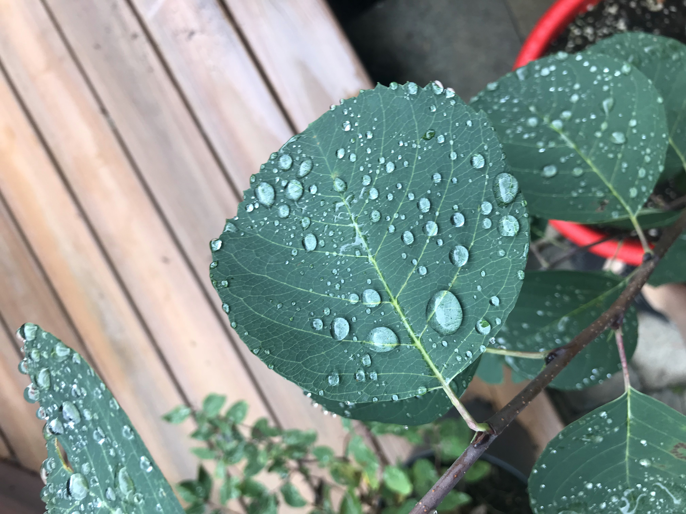 |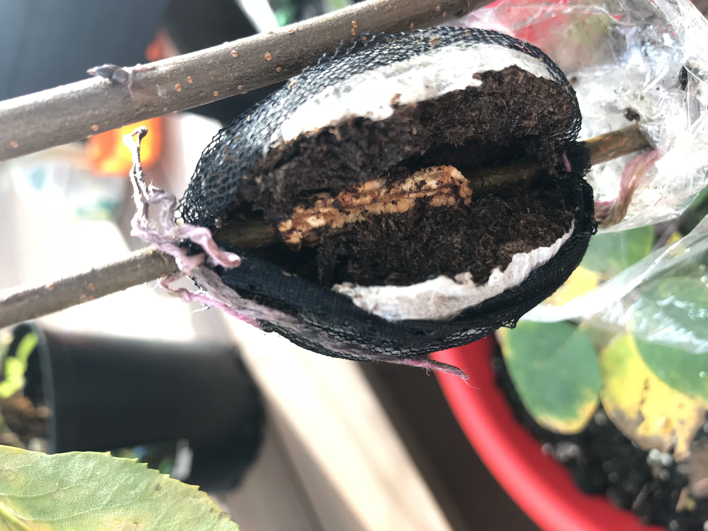
|:--:|:--:|
| Feuille du plant (2019/08/28) | Développement de tissu au site de tentative de 'bouturage aérien' (2019/10/20) |

### 2020

Tranplantation dans gros pot beige à spirales. 

Ajout d'un moustiquaire au début du développement des fruits pour éviter attaque par mouches.

Croissance jusqu'à environ 1.2 de hauteur + quelques branches latérales très longues.

* Sortie au printemps : 6 mai
* Emplacement : Patio (mi-ombre)
* Floraison : Fin mai
* Production : Quelques baies seulement, **aucunement** sucrées comme l'étaient en 2020. Pollinisation déficiente ? 
* Test de bouturage : formation de tissu après quelques semaines, mais aucune formation de racines. 

| 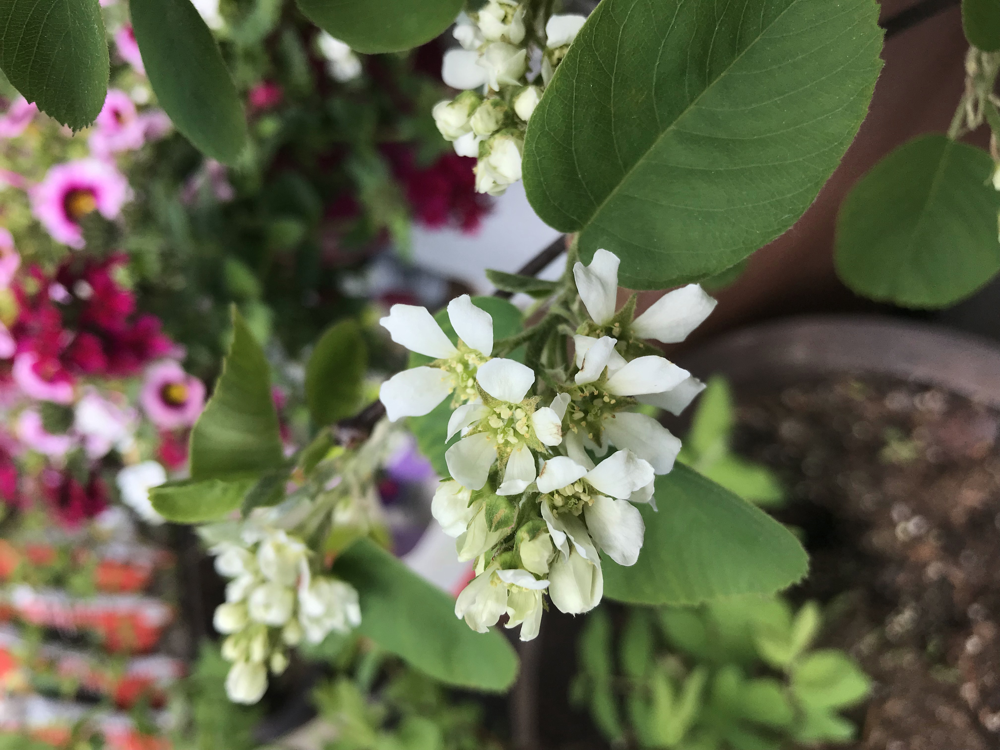 | 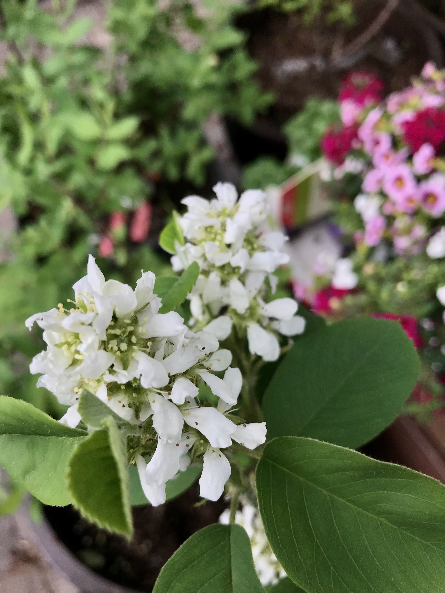 |
|:--:|:--:|
| Floraison (2020/05/28) | (2020/05/29) |

### 2021

Ajout compost à la mi mai. 

Aucune floraison ni production :( Épuisement ou manque de soleil ? 

Croissance jusqu'à environ 1.6 m de hauteur. Le plant est maintenant plus grand que moi. 

> **Installer dans plate-bande plein soleil l'an prochain**

* Sortie au printemps : Fin avril
* Emplacement : Patio (mi-ombre)
* Floraison : Aucune 
* Production : Aucune 

# **Bleuets cultivés**

## Northblue

* Achat : 2021 (Pépinière Jean Gagné, St-Lambert)

#### 2021 

Acheté en mai comme 'compagnon de pollinisation' pour Patriot. Beaucoup de fleurs à l'achat. Environ 50 cm de hauteur.

* Production : environ 1 tasse de baies sucrées au bon goût, mais presque toutes mangées par Naya.
* Emplacement : Deck piscine (mi-ombre-soleil)

|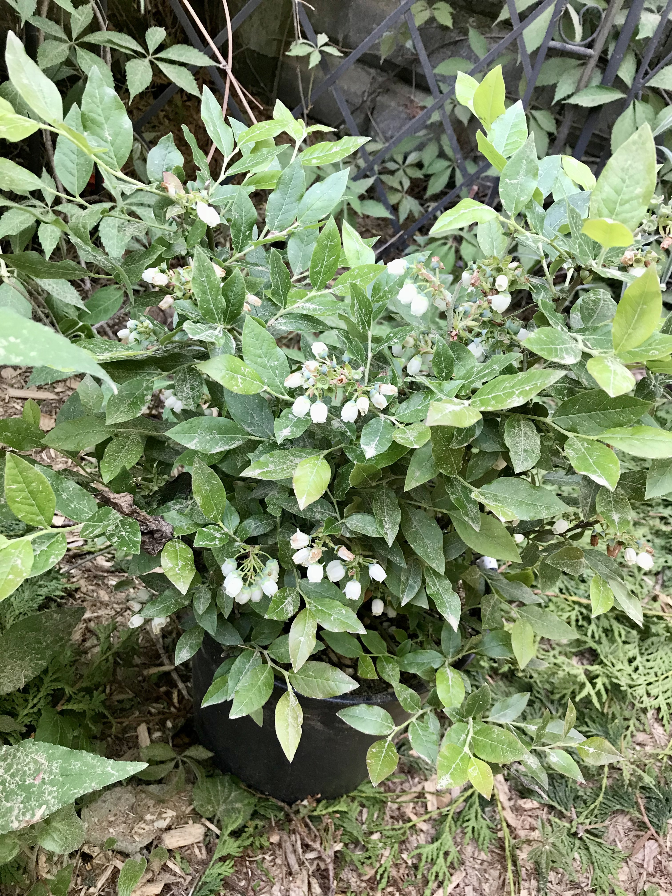 |
|:--:|
| Northblue en pleine floraison dans son contenant d'origine (2020/06/06) |

## Patriot

* Achat : 2019 (Bourbeau, Charlesbourg)

### 2019

Environ 60 cm de hauteur à l'achat.

* Emplacement : Patio (mi-ombre)
* Production : Quelques baies seulement en août - normal, compte-tenu de l'âge et la taille du plant.

| 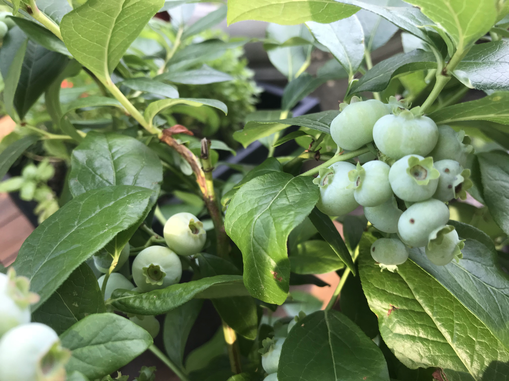 | 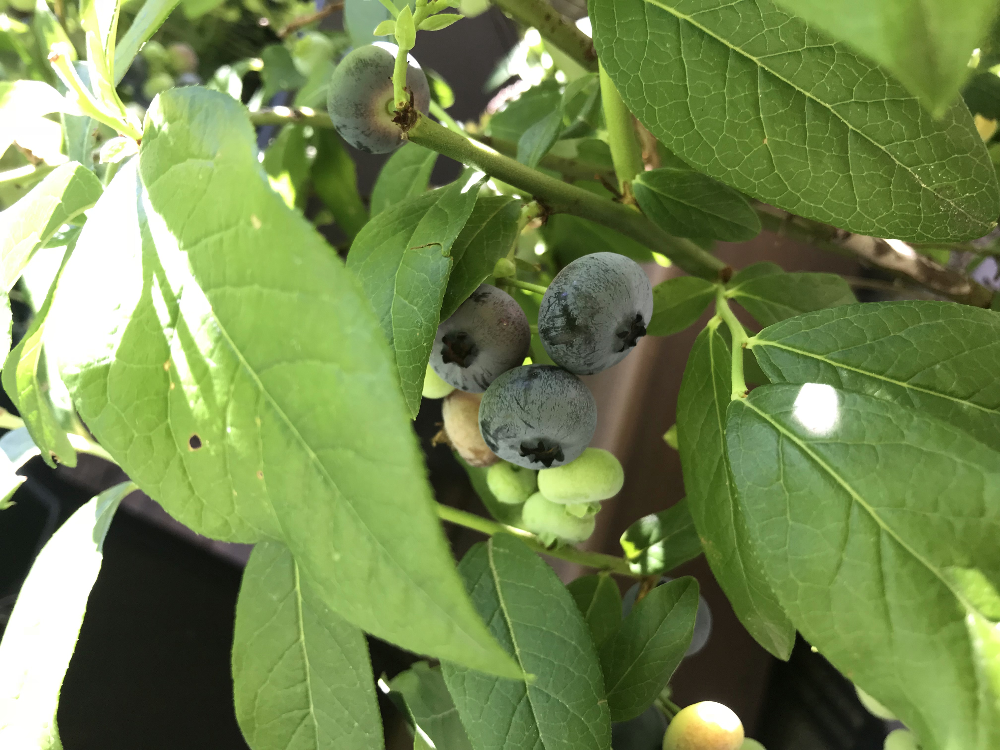 |
|:--:|:--:|
| Fruits quelques semaines après achat (2019/07/29) | Fruits plus matures (2019/08/13) |

### 2020

Croissance à environ 1 m de hauteur et émergence de plusieurs tiges latérales.

Apparition champignon gris sur tiges : maladie fongique à identifier ? Tx à la bouillie souffrée avant la mise en hibernation.

* Sortie au printemps : 6 mai
* Emplacement : Patio (mi-ombre)
* Floraison : Autour du 25 mai
* Production : Environ 0.5 tasse de baies en début août. Production assez faible : besoin + d'ensoleillement ? 

| 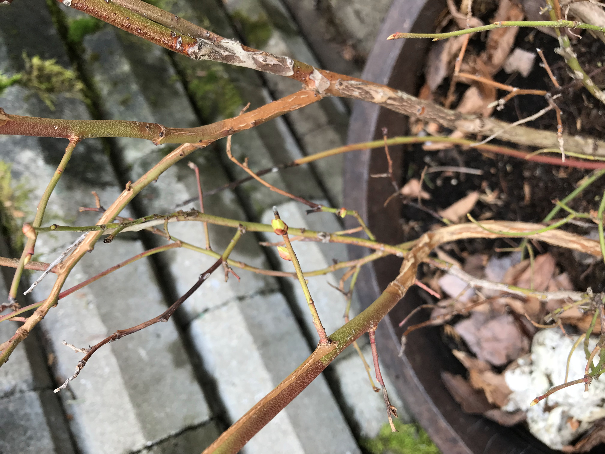 | 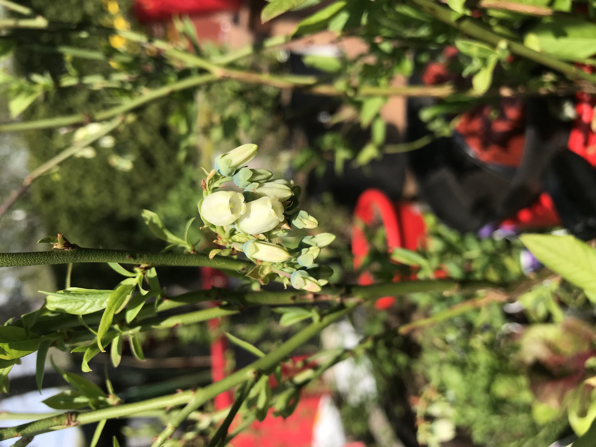 |
|:--:|:--:|
| Champignon gris sur les tiges à la sortie au printemps (2020/05/06) | Début de floraison (2020/05/26) |

| |
|:--:|
| Petite amie au travail ! (2020/05/30) |

#### 2021

Croissance à environ 1.4 m de hauteur et beaucoup de croissance des tiges et des feuilles. Meilleure année jusqu'à maintenant, pour la croissance et la production. 
Ajout d'un filet pour réduire les vols par les écureuils et Naya. Ça n'a pas fonctionné avec Naya. 
Pas de progression de la maladie fongique inconnu.

* Sortie au printemps : 9 avril, **très tôt**
* Emplacement : Plate-bande arrière (mi-ombre-soleil)
* Floraison : Autour du 17 mai
* Production : > 1 litre sur 4 semaines, entre fin juillet et fin août. Le chien a mangé au moins le tiers de cette production.

> Super rendement, installer dans plate-bande l'an prochain !

| 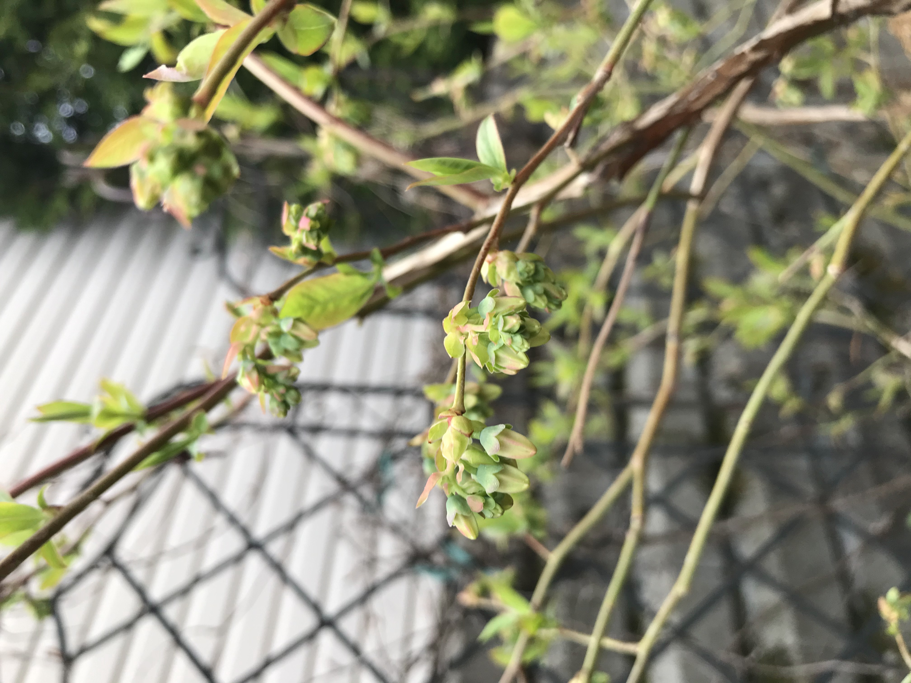 | 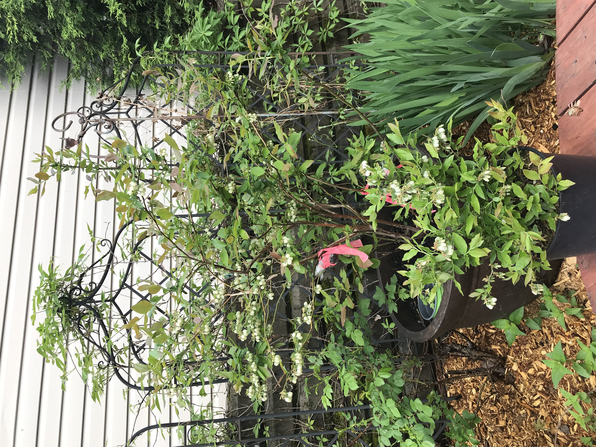 |
|:--:|:--:|
| Début de floraison (2021/05/17) | Grand plant de Patrio en floraison (pot brun) derrière son petit frère Northblue (2021/05/26) |

## Pink Popcorn

Cultivar de bleuets à fruits **roses** (comme Pink Lemonade).

* Achat : 2020 (Multi-Feuillage, Port-Rouge)

#### 2020

Environ 60 cm de hauteur à l'achat. Pas beaucoup de tiges ni de feuilles, mais déjà beaucoup de fleurs à l'achat. 
Transplanté en gros pot jaune dans mélange de terre acide et de gravier en septembre. 
Fruits mûrs lorsqu'ils sont rendus uniformément roses et mous comme un bleut normal à maturité.

* Emplacement : Patio (mi-ombre)
* Floraison : Mi-Mai
* Production : Quelques baies seulement, au goût **très** sucré et bon, mais différent de celui du bleuet cultivé bleu standard.

|  | 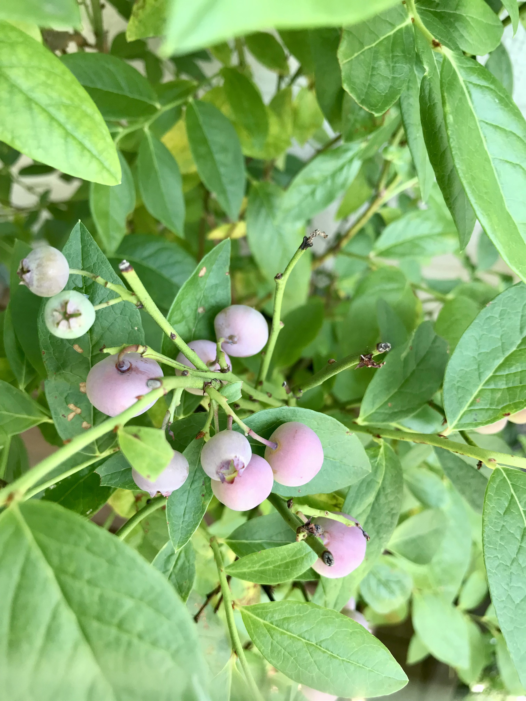 |
|:--:|:--:|
| Floraison (2020/05/20) | Petite production de bleuets Pink Popcorn (2021/08/07) |

#### 2021

Pas beaucoup de croissance en hauteur (rendu à environ 70-80 cm de hauteur), mais quelques nouvelles branches. Aucune floraison ni production : est-ce que la transplantation en septembre 2020 était trop tardive ? Système racinaire sous-développé qui a mal toléré l'hiver ? Variété pas assez rustique ?

Autrement, le plant semble en très bonne santé.

* Sortie au printemps : 9 avril, **très tôt**
* Emplacement : Plate-bande arrière (mi-ombre-soleil)
* Floraison : Aucune
* Production : Aucune

| |
|:--:|
| Plant de Pink Popcorn (pot jaune à droite) à côté de Patriot | (2021/10/23) |

## Sweetheart

* Achat : 2020 (Jardin Jasmin, Montréal)
* Particularités : Feuilles anormalement rondes et possibilité de 2 floraison

#### 2020

Environ 50 cm de hauteur à l'achat. Pas beaucoup de tiges ni de feuilles, mais déjà beaucoup de fleurs. 

#### 2021

* Sortie au printemps : 9 avril, **très tôt**
* Emplacement : Plate-bande arrière (mi-ombre-soleil)
* Floraison : Aucune
* Production : Aucune

| 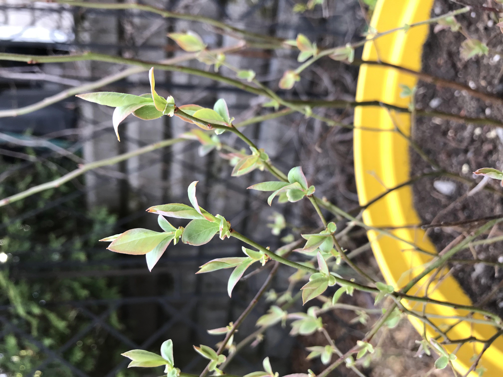 |  |
|:--:|:--:|
| Émergence des feuilles de Sweetheart (2021/05/17) | Sweetheart à l'automne (2021/10/23) |

# **Bleuets sauvages**

## Plants sauvages du chalet

* Mise en culture : 2020

# **Camerises**

## Berry Blue + Aurora   &   Berry Blue + Indigo Gem

* Achat : 2019 (Bourbeau, Charlesbourg)
* Pas encore de vraie production au delà de 10-20 baies

#### 2019

Transplanté dans gros pots carrés gris à la fin de l'été. 

* Emplacement : Patio (mi-ombre)
* Floraison : Aucune 
* Production : Aucune 

#### 2020

* Sortie au printemps : 6 mai
* Emplacement : Patio (mi-ombre)
* Floraison : Autour du 25 mai
* Production : Quelques baies

#### 2021

* Sortie au printemps : 9 avril, **très tôt**
* Emplacement : Plate-bande arrière (mi-ombre-soleil)
* Floraison : Fin avril
* Production : Quelques baies en juin

# **Canneberges**

## Stevens

* Achat : 2020 (Jardin Jasmin, Montréal)
* Pas encore de production

#### 2020

Transplanté dans gros pot gris à la fin de l'été, dans terre acide + gravier.

* Emplacement : Patio (mi-ombre)
* Floraison : Quelques fleurs au moment de l'achat fin mai
* Production : Aucune 

#### 2021

La plant a l'air d'avoir trouvé l'hiver difficile : beaucoup de tiges semblaient mortes à la sortie de son hibernation, mais quelques fleurs sont sorties . Reprise de la croissance tard en saison.

* Sortie au printemps : 9 avril, **très tôt**
* Emplacement : Plate-bande arrière (mi-ombre-soleil)
* Floraison : Mai
* Production : Aucune

# **Cassis**

## Ben Connan (Old Ben Kenobi)

Variété britannique. Un peu sensible à la rouille vésiculeuse du pin blanc.

* Achat : 2018 (Hamel ou Bourbeau)

#### 2018

#### 2019

#### 2020

#### 2021

## Ben Sarek

Variété britannique. Sensible à la rouille vésiculeuse du pin blanc.

* Achat : 2019 (Bourbeau, Charlesbourg)

#### 2019

#### 2020

#### 2021

## Ben Tirran

Variété britannique. Sensible à la rouille vésiculeuse du pin blanc.

* Achat : 2019 (Bourbeau, Charlesbourg)

#### 2019

#### 2020

#### 2021

## Thasis (?)

Variété très productive développée par McGinnis Berry Crops (Colombie-Britannique). Résistante à la rouille vésiculeuse du pin blanc. 

* Feuille légèrement différente de celle des cultivars anglais
* Achat : 3 plants de 1 an en 2021 (Pépinière des Pioniers, Mont-Louis, Gaspésie)
  + Variété vendue sous le nom de Soeur ?
  + Plants à racines nues cultivés en sol argileux (bcp d'argile sur les racines à la réception)
  + Reçus le 17 mai 2021
  + Bourgeons de feuilles jaunies à la réception (feuilles redevenues normales dans les jours suivants)
   

#### 2021
Transplanté en mai le plus gros plant dans gros rouge et les 2 plus petits dans des contenants temporaires de 2 gallons (enterés dans le sol en novembre pour protection hivernale).

* Emplacement : Plate-bande arrière (mi-ombre-soleil)

# **Groseilles**

## Cultivar inconnu du chalet

2 plants de groseilles plantés au chalet dans les années 70. Achetés chez Perron à l'époque, mais aucune trace de ces groseillers dans leurs catalogues. 

## **Captivator**

* Achat : 2019 (Serres Sainte-Julie, Ste-Julie)

# **Thé des bois**

## Cultivar inconnu

* Achat : 2020 (Jardin Jasmin, Montréal)

#### 2020

#### 2021
