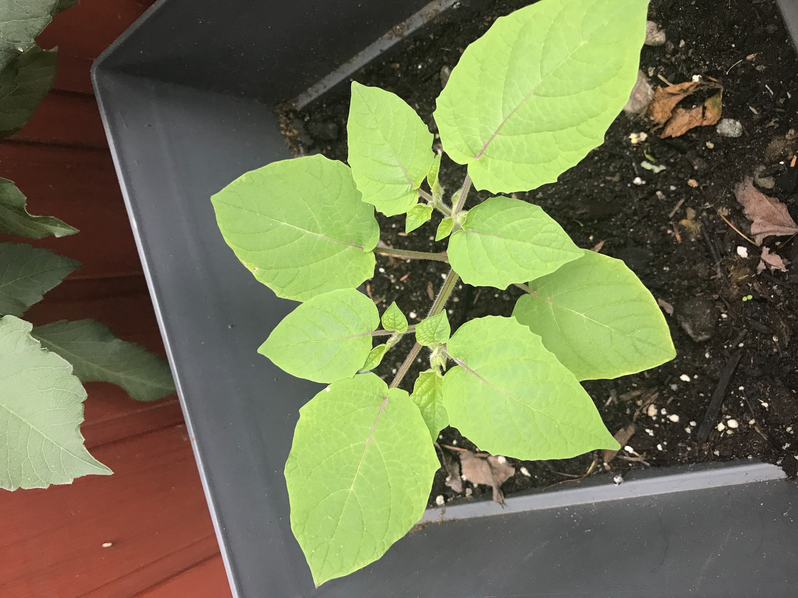
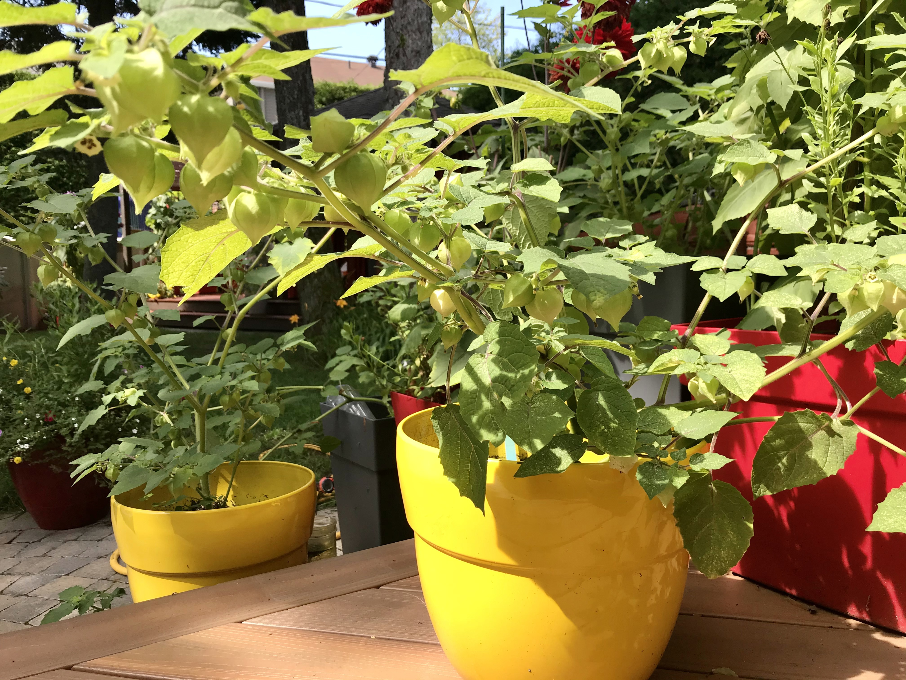
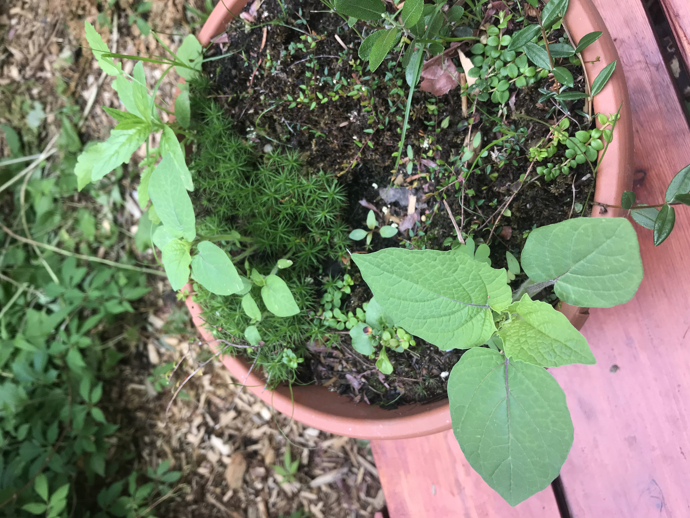
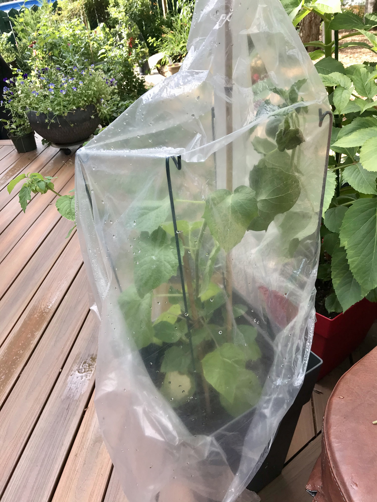
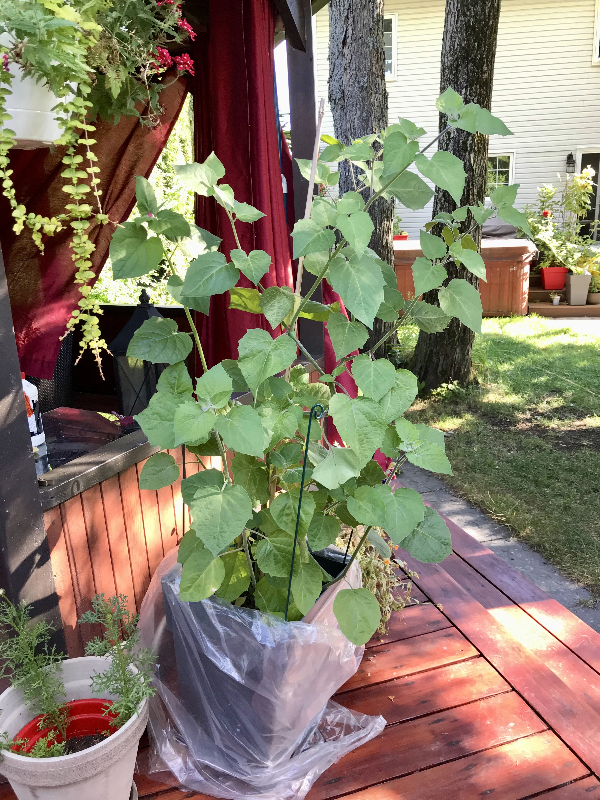
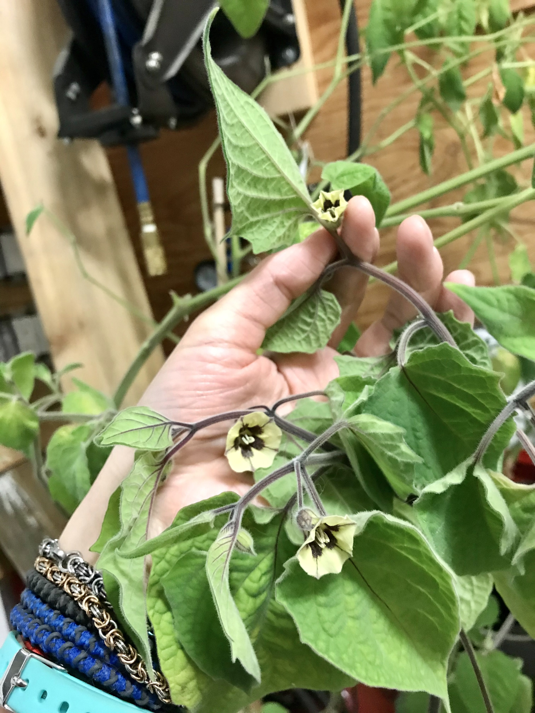
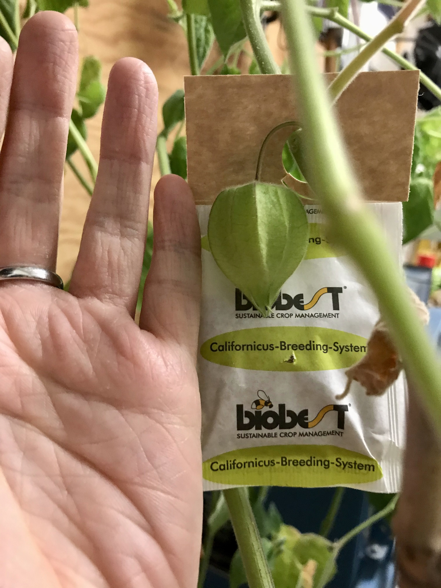
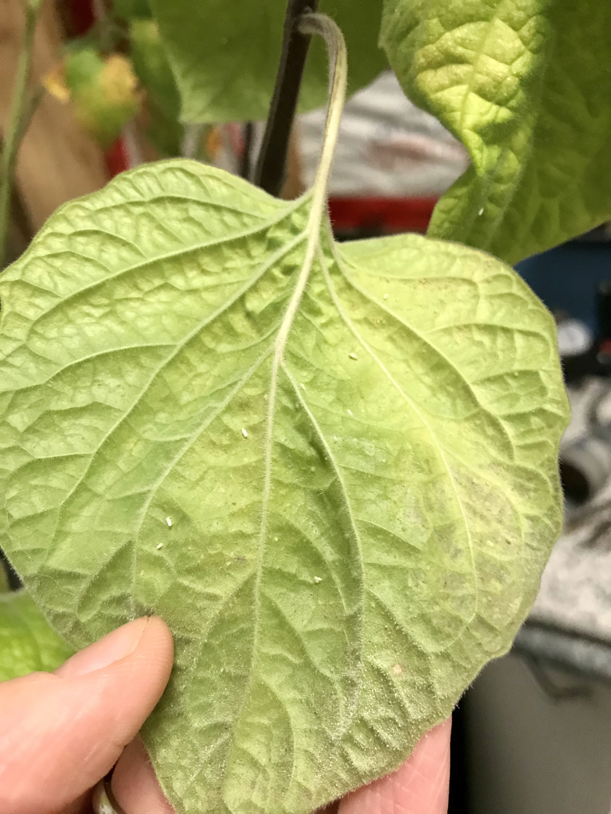

# Cerises de terre

## Aunt Molly's 
Variété ancienne vraiment sucrée et bonne. Plants de 50-60 cm de haut. TRÈS SENSIBLE aux tétranyques, en serre et à l'extérieur.

* 2020 : 2 plants en pots moyens. Très productifs et fruits très sucrés.
* 2021 : 6 semis intérieurs en mars. Transplantés en pots + 2 en terre, mais très mauvaise production, fruits peu goûteux. Trop chaud, trop sec ?
  + Certains plants sont apparus spontanément là où des animaux avaient mangé des fruits en 2020.

|  |  |
|:--:|:--:|
| Plant de Aunt Molly's en début de croissance en pot (2021/06/22) | Plants avec leurs fruits (2021/08/17) |

|
|:--:|
| Plants de Aunt Molly's "bénévoles" semés par les écureuils en 2020 (2021/06/22) | 

## Coqueret du Pérou (*Physalis peruviana*)
Grosse cerise de terre orangée, environ 2 cm de diamètre. Plant à croissance indéterminée, beaucoup plus grand que ceux de cerise de terre standard. Moins sensibles aux tétranyques.

* 2021 : 1 plant en pot, semis en février. Croissance lente en début de saison. Croissance plus rapide en juillet sous toile de plastique : besoin de chaleur. Floraison tardive en août. Pas de production pendant la saison. 
  + Tentative de cultiver le plant à l'intérieur en septembre et croissance en serre pour le reste de l'année. Floraison à l'intérieur en oct-novembre, mais prolifération d'aleurodes... 

|  |  |
|:--:|:--:|
| Plant de coqueret sous toile (2021/08/02) | (2021/09/01) |  

|  |  |
|:--:|:--:|
| Floraison à l'intérieur (2021/12/05) | Fruit (2021/12/05) |

|
|:--:|
| Feuille attaquée par les aleurodes (2021/12/01) |

