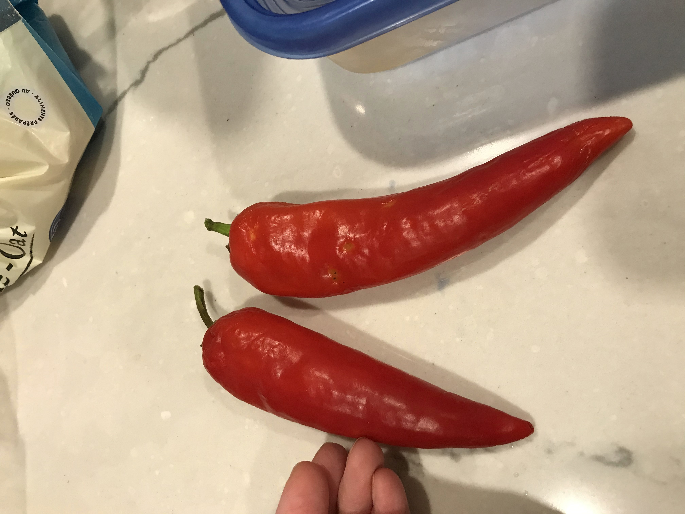

# Piments

### Hungarian Hot Wax
Piment fort. Couleur jaune à maturité, mais peut être récolté rouge pour + de goût fort.

* 2021 : 1 semis en mars, transplanté dehors en bac noir long en mai. Peu de production.
  + Production : 3 piments pour déshydratation.

|
|:--:|
| Hungarian Hot Wax (2021/10/08) |

### Tunisian Baklouti
Piment fort. Rouge à maturité.

* 2021 : 1 semis en mars, transplanté dehors en bac noir long en mai. Aucune production.
