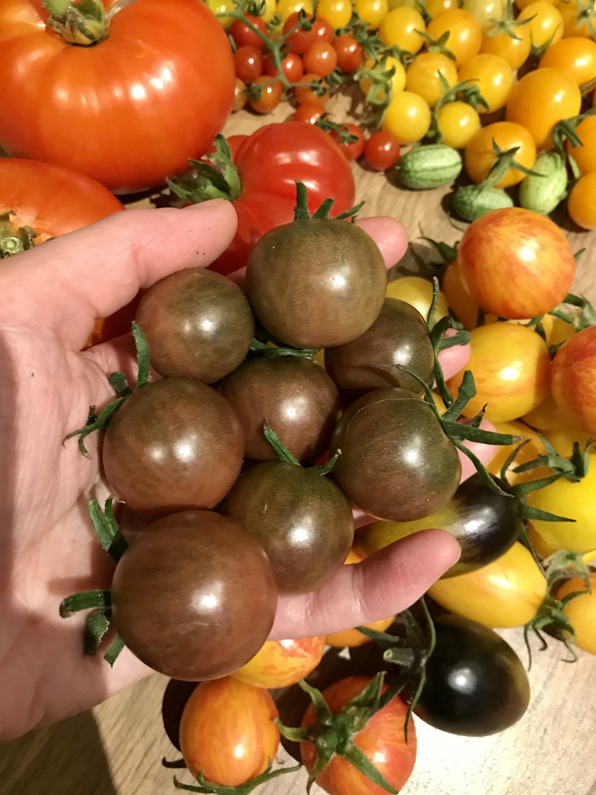

# Tomates

## Tomates cerises

### Golden cherry 

Tomate cerise orange très sucrée, goût excellent. 
Mauvaise odeur. S’enracine très facilement, bouturage facile. Très productif et forte croissance verticale.

* 2020 : Dernier plant à geler et à être infecté par late blight. 1 plant en pot.
* 2021 : Encore un des plants les + productifs et tolérants au froid. 1 plant en pot et 1 plant en terre.
  + Production : 111 tomates

|  |  |
|:--:|:--:|
| Plant de Golden Cherry (2020/08/23)  | Grappe de fruits (2021/08/19) |

### Esterina
Tomate cerise jaune sucrée, très bon goût.
Peu sensible aux pathogènes. Très productif. Croissance en largeur et en hauteur, moins haut que Golden Cherry. 

* 2020 : Avant dernier plant à geler. 1 plant en pot.
* 2021 : Bonne production, 1 plant en pot et 1 plant en terre.
  + Production : 99 tomates
 
| |
|:--:|
| Grappe de Esterina (2020/08/23) |

### Candyland
Tomate groseille rouge en grosses grappes. Peu sucrée.
Sensible aux maladies. Fruits fendent facilement. Port buissonnant. Grappes souvebt ramifiées en plusieurs branches (photos droite), mais parfois linéaires (photo gauche).

* 2020 : Parmis les premiers plants malades. 1 plant en pot.
* 2021 : 1 plant en pleine terre. Encore parmis les premiers malades. Faible production :( 
  + Production : 43 tomates

|  |  |
|:--:|:--:|
| Grappe de Candyland (2020/08/13)  |  (2021/08/27) |


### Chocolate
Grosse tomate cerise (1 po de diamètre) brune et sucrée, bon goût. Assez productive.
Fendille plus facilement que les plus petites. Peu de croissace latérale (+ de croissance en hauteur, environ 6 pieds).

* 2020 : Feuilles ont séché en fin de saison. Assez productive, mais pas autant que les variétés top de tomates cerises (Golden Cherry, Esterina). 1 plant en pot.
* 2021 : Moins bonne production qu'en 2020. Flétrissement inhabituel. 2 plants en terre.
  + Production : 43 tomates

|  |  |
|:--:|:--:|
| Plant de Chocolate avec mildiou avancé en fin de saison (2021/09/17)  |  Fruits (2021/09/14) |

### Bumble bee
Grosse cerise oblongue (>1po) marbrée. Goût doux et bon.
Variété moyennement productive. Sensible aux maladies en fin de saison. Croissance latérale > verticale.

* 2020 : Mildiou et late blight en fin de saison. 2 plants en pot. Seulement des Bumble Bee roses. Rendement le plus faible des variétés de cerises.
* 2021 : Meilleure production qu'en 2020, mais maladies plus précoces. 2 plants en terre.
  + Production (Bumble Bee Yellow) : 29 tomates
  + Production (Bumble Bee Red) : 34 tomates
  
|  |  |
|:--:|:--:|
| Plant de Bumble Bee jaune (2021/09/01)  |  Plant de Bumble Bee rouge (2021/09/01)) |

### Sunpeach
Très bon goût et belle couleur rosée. Légèrement oblongue.
Plus productive que Chocolate, mais moins que Golden cherry et Esterina. Belles grappes. Croissance latérale = croissance verticale. Plutôt sensible aux maladies.

* 2020 : Late blight en août. 1 plant en pot.
* 2021 : Meilleure production qu'en 2020. 1 plant en pot, un des premiers plants de tomates cerises à être infecté par late blight.
  + Production : 35 tomates

|  |
|:--:|
| Sunpeach (2020/08/23) |

### Rose Quartz Multiflora
Petite tomate cerise rose (<1 po diamètre) qui pousse en grappes de fleurs TRÈS nombreuses.

* 2021 : Floraison TRÈS tardive en août et maladies précoce. 1 plant en pot.
  + Production : 15 tomates

### Blush
Grosse tomate cerise oblongue (>1 po de longueur), jaune marbrée de rouge. Goût sucré et fruité EXCELLENT ! Plant indéterminés mais de petite taille (< 1.5 m de haut).

* 2021 : Floraison précoce et apparition rapide des fruits (début juin). 
  + Production : 33 tomates

|  |
|:--:|
| Grappe de fruits Blush (2021/08/11) |


### Groseille rouge (petit moineau)
Tomate groseille (*Solanum pimpinellifolium*) rouge de petite taille (max 1 cm diamètre). Plant entièrement glabre. Croissance latérale **monstrueuse**, énormément de ramifications. Bonne tolérance aux maladies, à la sécheresse et au froid.

* 2021 : 1 plant en terre (sur face cabanon). Peu sucrée. Production jusqu'aux gels.
  + Production : 158 tomates


```{r, echo=FALSE, out.width="50%", fig.align = "center", fig.show='hold', fig.cap="Grappe de fruits Petit moineau (2021/08/17)   ;   Section du plant (2021/08/27)" }
knitr::include_graphics(c("photos_jardin/IMG_3491.jpg","photos_jardin/IMG_3581.jpg"))
```


### Groseille orange 
Tomate groseille (*Solanum pimpinellifolium*) orangée de petite taille (max 1 cm diamètre). Plant entièrement glabre. Croissance latérale **monstrueuse**, énormément de ramifications.

* 2021 : 1 plant en terre (sur face cabanon). Plus productive que Petit moineau rouge. Peu sucrée. Production jusqu'aux gels.
  + Production : 314 tomates
  

```{r, echo=FALSE, out.width="50%", fig.align = "center", fig.show='hold', fig.cap="Grappe de fruits de tomate mini orange (2021/08/17)" }
knitr::include_graphics("photos_jardin/IMG_3492.jpg")
```


### Groseille jaune
Tomate groseille jaune de la taille d'un raisin, plus grande que groseille rouge/orange. Plant poilu : semble plus proche de tomate standard (*S. lycopersium*) que de tomate groseille (*S. pimpinellifolium*). Croissance latérale **monstrueuse**.

* 2021 : 1 plant en terre (sur face cabanon). Amer. Production jusqu'aux gels.
  + Production : 173 tomates


```{r, echo=FALSE, out.width="50%", fig.align = "center", fig.show='hold', fig.cap="Grappe de fruits de tomate mini jaune (2021/08/17)" }
knitr::include_graphics("photos_jardin/IMG_3494.jpg")
```

### Groseille blanche
Tomate groseille blanche de la taille d'un raisin, plus grande que groseille rouge/orange. Plant poilu : semble plus proche de tomate standard (*S. lycopersium*) que de tomate groseille (*S. pimpinellifolium*). Croissance latérale **monstrueuse**.

* 2021 : 1 plant en terre (sur face cabanon). Amer. Production jusqu'aux gels.
  + Production : 294 tomates
  

```{r, echo=FALSE, out.width="50%", fig.align = "center", fig.show='hold', fig.cap="Grappe de fruits de tomate mini blanche (2021/08/17)" }
knitr::include_graphics("photos_jardin/IMG_3495.jpg")
```

### Millefleur
Petite tomate cerise jaune (< 1 po diamètre) dans des grappes très fournies, de plusieurs dizaines de fleurs. 

* 2021 : 1 plant en pot. 
  + Production : 65 tomates
  

```{r, echo=FALSE, out.width="50%", fig.align = "center", fig.show='hold', fig.cap="Grappe de fleurs de Millefleur (2021/08/11)" }
knitr::include_graphics("photos_jardin/IMG_3403.jpg")
```

  
### Cerise blanche
Tomate cerise blanche crème et sucrée. 

* 2021 : 1 plant en pot. 
  + Production : 86 tomates
  

```{r, echo=FALSE, out.width="50%", fig.align = "center", fig.show='hold', fig.cap="Plant de tomate cerise blanche (2021/09/01)   ;  Fruits de cerise blanche et de Sunpeach (2021/09/20)" }
knitr::include_graphics(c("photos_jardin/IMG_3700.jpg", "photos_jardin/IMG_3967.jpg"))
```


### Brad's Atomic
Tomate cerise oblongue (>1 po de longueur) marbrée de violet, vert, brun... Bon goût.

* 2021 : 1 plant en pot. 
  + Production : 16 tomates


```{r, echo=FALSE, out.width="50%", fig.align = "center", fig.show='hold', fig.cap="Grappe de Brad's Atomic (2021/09/01)   ; Fruit presque mature (2021/08/29)" }
knitr::include_graphics(c("photos_jardin/IMG_3665.jpg", "photos_jardin/IMG_3637.jpg"))
```


### Tumbler
Tomate cerise à port compact pour jardinière. 

* 2021 : 1 plant en jardinière, production nulle. Beaucoup de mortalité des semis : maladie fongique ? Graines infectées ? 
  + Production : 0   :( 


## Grosses tomates
### Bobcat
Bon et beau fruit rouge de taille moyenne (environ 2 po de diamètre). Plant compact, 50-60 cm de haut. Très bonne tolérance aux maladies.

* 2020 : Démarrage difficile au début de croissance à cause de thrips. 2 plant en pot moyen (5 gallons)
* 2021 : BEAUCOUP moins performante qu’en 2020, pas production avant fin août, possiblement trop à l'ombre. 1 plant en terre
  + Production : 0 tomate. What a failure... 
  + 1 plant dans bac au chalet. Le plant du chalet a eu une croissance indéterminée de > 2.5 m et a produit beaucoup de fruits plus petits (autour de 1 po de diamètre) : erreur d'ensachage ou génétique instable ???


```{r, echo=FALSE, out.width="50%", fig.align = "center", fig.show='hold', fig.cap="Plant de Bobcat normal (2020/08/13)   ;   Plant de Bobcat à croissance anormale (2021/09/19)" }
knitr::include_graphics(c("photos_jardin/IMG_9556.jpg", "photos_jardin/IMG_3943.jpg"))
```

     

### Costoluto fiorentino
Beau fruit rouge côtelé, goût moyen. Plant vigoureux et productif. Sensible à la pourriture apicale et aux maladies. Ne semble pas bien tolérer la culture en pot (ex. 2020).

* 2020 : Fruits semblent piqués (tissu dur noirci). 1 plant en pot.
* 2021 : Beaucoup moins de pourriture apicale qu'en 2020. 1 plant en terre.
  + Production : 6 tomates


```{r, echo=FALSE, out.width="50%", fig.align = "center", fig.show='hold', fig.cap="Plant de Costoluto fiorentino (2020/08/23)   ;   Fruit (2021/10/17)" }
knitr::include_graphics(c("photos_jardin/IMG_9683.jpg", "photos_jardin/IMG_4274.jpg"))
```

     
```{r, echo=FALSE, out.width="50%", fig.align = "center", fig.show='hold', fig.cap="Pourriture apicale (2020/08/05)" }
knitr::include_graphics("photos_jardin/IMG_9436.jpg")
```


### Lemon Boy
Fruit jaune moyen (<2 po diamètre) au goût très (trop ?) doux. Plant un peu chétif. Peu productif.

* 2020 : 1 plant en pot. Plant chétif. Aucun fruit n’a mûri sur le plant :( 
* 2021 : 1 plant en terre. Encore peu productif.
  + Production : 2 tomates

     
```{r, echo=FALSE, out.width="50%", fig.align = "center", fig.show='hold', fig.cap="Tomate Lemon Boy à point (2021/09/14)" }
knitr::include_graphics("photos_jardin/IMG_3876 - Copie.jpg")
```


### Patio Hybrid
Supposée être une tomate moyenne produite par plant compact de 50-60 cm de haut. Pas encore réussi à en produire suffisament.

* 2021 : 1 plant en pot, starté à l'intérieur dans serre à l'automne 2020. A survécu à la "tragédie du 26 janvier 2021", i.e. passage de 20 à -25 degrés à cause de porte de garage ouverte.
  + Production : 1 tomate


### Big Beef
Big best! Gros fruit (>2 po diamètre) rouge et bien charnu. Excellent goût. Plants très très vigoureux. Un peu sensible aux maladies. 

* 2020 : Leaf spot en fin de saison. 1 plant en pot.
* 2021 : Meilleure production qu'en 2020. Grappes avec fruits plus nombreux. 2 plants en terre, 1 dans jardin et 1 derrière piscine. Plant derrière piscine a été plus productif : plus de soleil ?
  + Production : 7 tomates

```{r, echo=FALSE, out.width="50%", fig.align = "center", fig.show='hold', fig.cap="Naya et sa récolte de Big Beef (2020/08/30)" }
knitr::include_graphics("photos_jardin/IMG_9753.jpg")
```

```{r, echo=FALSE, out.width="50%", fig.align = "center", fig.show='hold', fig.cap="Grappe de tomate Big Beef (2021/08/11)   ;   (2021/09/01)   ;   Tomate Big Beef mature (2021/09/12)" }
knitr::include_graphics(c("photos_jardin/IMG_3395.jpg", "photos_jardin/IMG_3663.jpg", "photos_jardin/IMG_3859.jpg"))
```

### Noire de Crimée
Grosse tomate brune rosée au goût étrange, épaules vertes. Plant robuste. Tendance au fendillement.

* 2021 : 1 plant en pot et 1 plant en terre. Plus performante en pleine terre. Beaucoup de fendillement, sensible à l'excès d'eau. Texture souvent "mushy" et peu goûteuse.
  + Production : 8 tomates

   
```{r, echo=FALSE, out.width="50%", fig.align = "center", fig.show='hold', fig.cap="Tomate Black Krim (2021/09/09)" }
knitr::include_graphics("photos_jardin/IMG_3811.jpg")
```

   
```{r, echo=FALSE, out.width="50%", fig.align = "center", fig.show='hold', fig.cap="Fendillement (2021/10/17)" }
knitr::include_graphics("photos_jardin/IMG_4260.jpg")
```


### Mr Stripey 
Grosse tomate jaune mangue avec marbrures rouges. Très beau fruit charnu, patron de coloration "oeil de Sauron". Goût sucré agréable. Plant très vigoureux.

* 2021 : 1 plant en terre. Tendance au fendillement.
  + Production : 4 tomates

   
```{r, echo=FALSE, out.width="50%", fig.align = "center", fig.show='hold', fig.cap="Tomate Mr Stripey au patron 'oeil de Sauron' (2021/09/19)" }
knitr::include_graphics("photos_jardin/IMG_3951.jpg")
```


### Chef's Choice Orange
Grosse tomate orange segmentée et charnue. Goût sucré agréable. 

* 2021 : 1 plant en terre. 
  + Production : 2 tomates

   
```{r, echo=FALSE, out.width="50%", fig.align = "center", fig.show='hold', fig.cap="Tomates Chef's Choice (2021/08/27)" }
knitr::include_graphics("photos_jardin/IMG_3582.jpg")
```


### Moskvich 
Tomate moyenne rouge produite en grappes de fruits. Bon goût.

* 2021 : 1 plant en pot. Plusieurs grappes de quelques fleurs. Mûrissement assez lent.
  + Production : 4 tomates

   
```{r, echo=FALSE, out.width="50%", fig.align = "center", fig.show='hold', fig.cap="Plant de tomates Moskvich (2021/09/01)   ;   (2021/09/14)" }
knitr::include_graphics(c("photos_jardin/IMG_3668.jpg", "photos_jardin/IMG_3867.jpg"))
```


### Rebel Star Fighter Prime
Grosse tomate (>2 po) en forme de coeur/virgule, avec marbrures rouges, brunes, violettes, vertes... Fruit charnu de très bon goût. Très bonne tolérance aux maladies. 

* 2021 : 1 plant en pot. Chétif mais productif. Plusieurs fruits ne sont pas parvenus à terme à cause du froid.
  + Production : 4 tomates

   
```{r, echo=FALSE, out.width="50%", fig.align = "center", fig.show='hold', fig.cap="Tomate Rebel Starfighter Prime (2021/08/27)   ;   (2021/09/09)" }
knitr::include_graphics(c("photos_jardin/IMG_3590.jpg", "photos_jardin/IMG_3813.jpg"))
```

```{r, echo=FALSE, out.width="50%", fig.align = "center", fig.show='hold', fig.cap="Plant de Rebel Starfighter Prime (2021/09/09)" }
knitr::include_graphics(c("photos_jardin/IMG_3666.jpg", "photos_jardin/IMG_3812_plant.jpg"))
```
